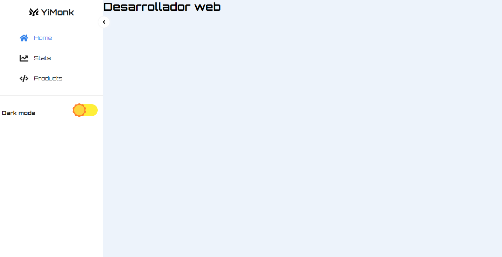
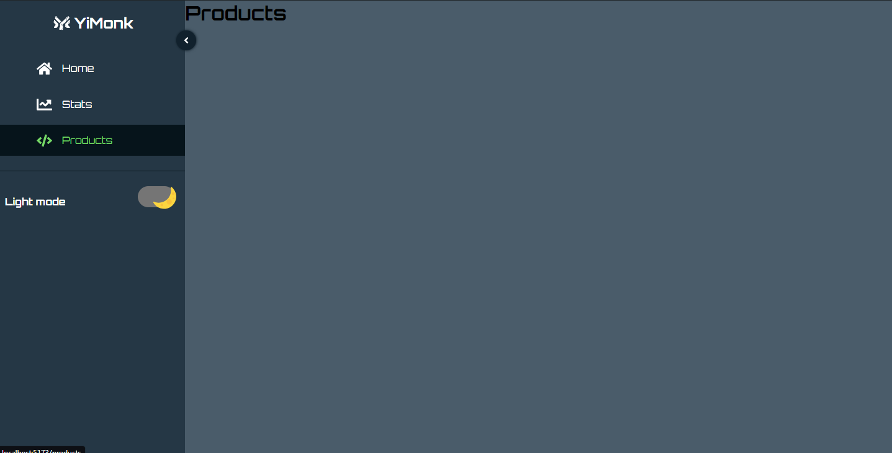

Este es un proyecto de sidebar realizado con vite con tema claro y oscuro

siguiendo el tutorial de Codigo 365
https://www.youtube.com/watch?v=kC3DAW2h0Dg&list=PLnIi81dI3dT0m13UdLD989enp7Mzetk7G&index=8

Tema Claro:

Tema Oscuro:

NOTA: Seguir practicando context
